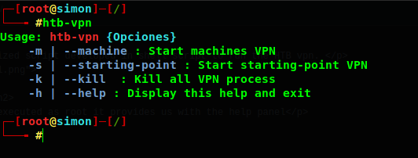
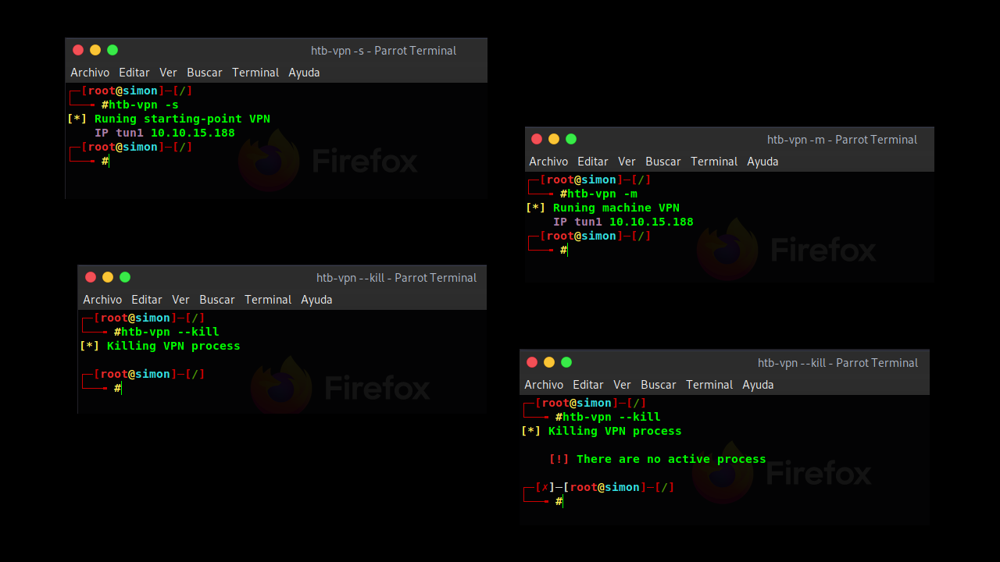

<h1>HTB-VPN</h1>

HTB-VPN is a automatized script developed in shell script to run the HTB vpn. 

<h2>How to run</h2>
<ol>
  <li>Open the htb-vpn and add the vpn path variable</li>
  <li><b>Optional</b> -> Create a simbolink link to /usr/bin</li>
  <li>Execute htb-vpn as root</li>
</ol>

<h2>How does it work?</h2>

Once the script is executed as root it provides us with the help panel

<ul>
  <li><b style=>-m -></b> <i>Allows to start the machine vpn (The most used)</i></li>
  <li><b style=>-p -></b> <i>Alow to start the starting-point vpn (For beginners in htb)</i></li>
  <li><b style=>-k -></b> <i>Kill all openvpn process or return a error if openvpn is asleep </i></li>
  <li><b style=>-h -></b> <i>Display the help menu and exit</i></li>
</ul>

<h2>Examples</h2>

